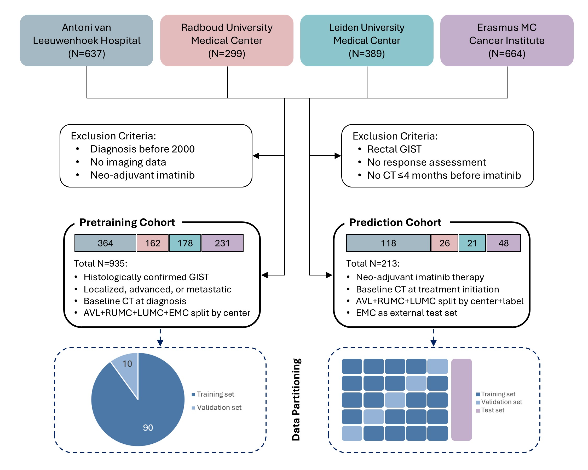
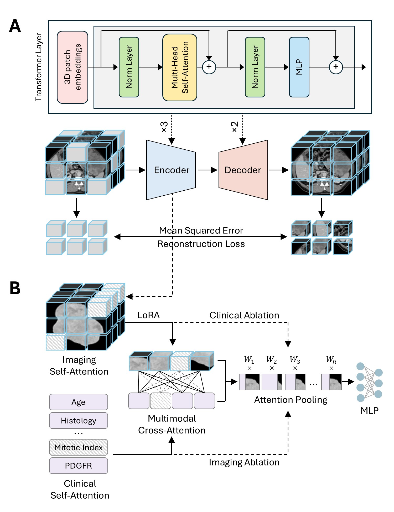

# Cross-Attention Multimodal Learning for Predicting Response to Neoadjuvant Imatinib in GIST

## Overview

This repository contains the code for developing explainable multimodal deep learning models that predict response to neoadjuvant imatinib in gastrointestinal stromal tumors (GIST) using:

* 3D CT imaging
* Clinical variables
* Transformer-based cross-attention multimodal fusion
* Self-supervised pretraining
* LoRA fine-tuning
* SMAC3 hyperparameter optimization

The framework is implemented using **FuseMedML**, **PyTorch Lightning**, and **SMAC3**.

---

## Study Design

<p align="center">
  
</p>

*Figure 1. Schematic of multicenter patient selection, cohort derivation, and data partitioning for pretraining and response prediction to neoadjuvant imatinib in gastrointestinal stromal tumors.*

---

## Framework Overview

<p align="center">
  
</p>

*Figure 2. Overview of analysis framework. A) Masked autoencoder pretraining of the imaging encoder using abdominal computed tomography in patients with gastrointestinal stromal tumors. B) Multimodal transformer-based cross-attention framework for predicting response to neoadjuvant imatinib through integration of clinical and CT-derived imaging information, with explicit missing-value and stochastic masking of clinical tokens, padding-aware masking of imaging tokens, and unimodal ablation architectures excluding cross-attention and complementary modality integration. Abbreviations: LoRA, Low-Rank Adaptation; MLP, Multilayer Perceptron.*

---

## Implemented Models

### Clinical Model

Transformer-based model using clinical variables only.

### Imaging Model

Transformer-based model using tumor-centered CT patches only.

### Cross-Attention Model

Proposed multimodal architecture integrating clinical and imaging tokens through bidirectional cross-attention.

---

## Citation

```bibtex
@article{tohidinezhad2026gist,
  title={Cross-Attention Multimodal Learning for Predicting Response to Neoadjuvant Imatinib in Gastrointestinal Stromal Tumors},
  author={Tohidinezhad, Fariba and colleagues},
  year={2026}
}
```

---

## Acknowledgements
This work used the Dutch national e-infrastructure with the support of the SURF Cooperative using grant no. EINF-14257, financed by the Dutch Research Council (NWO). We gratefully acknowledge the fundraising efforts of patients, families, and supporters from the GIST community, including a cycling initiative led by Rob Scheurink and collaborators, which contributed to the development of the imaging dataset.
